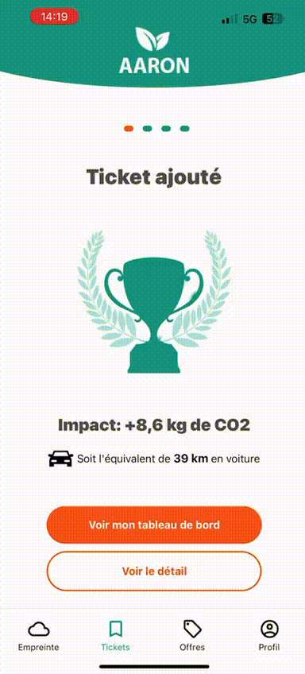
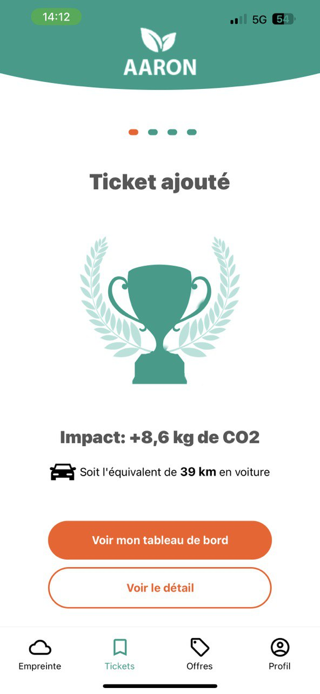

### AARON App

Ceci est un exemple de projet créé à l'aide de React Native.

1. Clonez ce référentiel sur votre ordinateur local.
2. Accédez au répertoire du projet dans votre terminal.
3. Exécutez  ` yarn install` pour installer les dépendances requises pour le projet.
4. Ensuite, exécutez `npx expo start` pour lancer le serveur de développement Expo.

``
yarn install
``
Ensuite
``
npx expo start
``

### Usage

Une fois le serveur de développement en cours d'exécution, vous pouvez utiliser l'application Expo Go sur votre
appareil iOS ou Android pour scanner le code QR affiché dans le
terminal ou la page Web Expo DevTools.
Cela vous permettra d'exécuter l'application sur votre appareil physique à des fins de test et de développement.
## Demo

## Screen Shot

## J'ai fait ces deux logos par Photoshop

